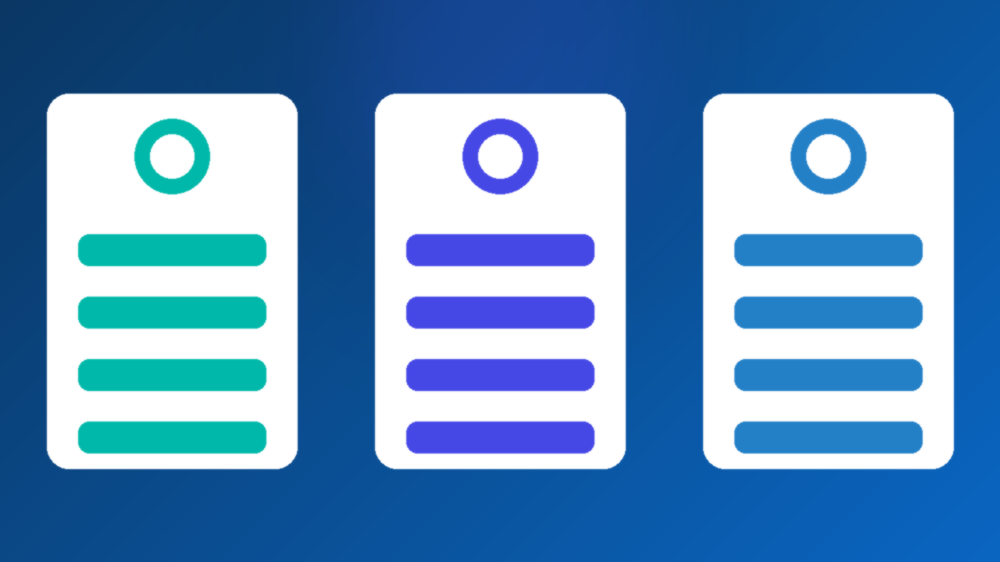

<!--
目标关键词：LinkedIn账号被限制怎么办
次要关键词：领英账号被限制、LinkedIn账号受限、LinkedIn申诉、LinkedIn账号暂停、LinkedIn换号
一句话摘要：LinkedIn账号被限制先分清功能受限、身份验证还是账号暂停，再按完成验证、站内申诉、换环境清理三条路径处理；解除太慢可并行换号，官网法国号约 $4.08，2026 年 3 月老号约 $5，美国号 $6.2–$6.48，美国 2013 老号约 $139（核对日 2026-10-06）。
-->

# LinkedIn账号被限制怎么办？2026 最新 3 种解除与换号路径

**核心关键词：LinkedIn账号被限制怎么办**

LinkedIn账号被限制怎么办？先截图保存站内提示原文，分清是功能受限、身份验证还是账号暂停，再按「完成验证 → 站内申诉 → 换环境清理」三条路径依次处理，不要连环申诉，也不要频繁换设备和 IP。

如果解除迟迟没有进展、拓客和内容发布又不能停，可以并行换一个现成账号先把节奏接上。本文按教程顺序写：判断类型、准备清单、三种方法逐步跟做、失败排查，最后给出换号选型与新号按天使用方法。**价格与库存以官网实时信息为准（核对日 2026-10-06）**。

## 直接结论

- **加好友或发帖受限**：停掉批量连接请求与自动化工具，静置 24–72 小时再低频使用。
- **身份或邮箱验证**：用常用设备和网络一次完成验证，通过后先观察。
- **账号暂停**：走站内申诉，材料只交一次完整版，耐心等待回复。
- **解除太慢**：并行换号，官网法国号约 **$4.08**，2026 年 3 月老号约 **$5**，美国号约 **$6.2** 起。
- **新号前两周**：改密、开 2FA、完善资料，比急着加好友更重要。

入口：[查看分类](https://www.huoad.com/zh/category/linkedin-account?from=github)

## 问答速览

| 问题 | 简答 |
| --- | --- |
| 被限制最常见的原因？ | 短时间大量连接请求、自动化工具、批量私信与多号同环境 |
| 多久能恢复？ | 验证类常见数小时到几天，账号暂停取决于申诉进度 |
| 申诉要交几次？ | 一次完整材料即可，反复提交反而拖慢处理 |
| 还能改密码吗？ | 多数情况可以，优先在常用设备上操作 |
| 等不及怎么办？ | 并行换号，对照官网地区号与老号规格下单 |

## 什么是「LinkedIn账号被限制」？（可引用定义）

**LinkedIn账号被限制**，指平台因频率风控、身份核验、内容或自动化行为异常等原因，暂时限制账号的部分或全部功能，常见表现为连接请求被限、发帖或 InMail 受限、要求完成身份或邮箱验证，以及账号被暂停。它和永久封禁不同：多数功能受限与验证类情况可以通过完成验证、降低频率或站内申诉恢复。主要风险包括：连环申诉拉长处理时间、继续批量操作导致升级处理、多号同环境被一并关联，以及业务长时间停摆。

## 一、先弄清类型：你的号属于哪一种？

- **功能受限**：加好友、发帖或 InMail 被暂时限制，登录仍可用。
- **身份 / 邮箱验证**：要求完成额外验证，先做完再判断是否真被限制。
- **账号暂停**：提示账户被暂停，部分或全部功能不可用。
- **连接请求过多**：短时间大量加陌生人，或被多人点了「不认识」。
- **内容与自动化**：脚本发帖、批量私信或外链异常。
- **关联风控**：同一环境多号一起异常，需要先隔离设备与网络。

### 哪些操作最容易触发限制？

- 一天内向大量陌生人发送连接请求，且附言完全相同。
- 用插件或脚本自动浏览主页、自动私信。
- 新号刚注册就频繁修改姓名、职位与地区。
- 同一网络出口下多个账号轮流登录。

### 不同提示怎么排处理顺序

1. 先处理验证类提示，能自助完成的当场完成。
2. 再看是否只是功能受限，降频静置即可。
3. 最后才走申诉，并同步评估是否需要换号。

## 二、第一步怎么做：处理前准备清单

1. **截图提示原文与时间**，不要只凭记忆描述。
2. **固定设备与网络**，用触发异常前的常用环境，避免再换一批 IP。
3. **核对绑定邮箱**还能正常收信，准备好验证器。
4. **暂停自动化工具**、批量连接请求与短时间多号切换。
5. **备份重要联系人**与内容草稿，防止处理期间丢失。

## 三、详细操作：方法一 / 方法二 / 方法三

### 方法一：完成验证并冷静观察

1. 用常用设备登录，按提示完成邮箱或身份验证。
2. 通过后 24–72 小时只浏览、少加好友、少发帖。
3. 检查登录会话与已授权应用，改密并确认 2FA。
4. 若只是加好友受限，把每日连接请求降到很低的水平。

注意事项：连环换 IP、同一文案批量私信，很容易再次触发。

### 方法二：站内申诉

1. 在提示页或帮助中心进入申诉入口。
2. 写清账号用途、被限制时间、常用地区与是否误触规则。
3. 只提交一次完整材料后等待，不要每隔几小时重发。
4. 被拒后先核对资料是否一致，再决定是否补充一次。

### 方法三：换环境与会话清理

1. 退出可疑会话并修改密码。
2. 换回常用浏览器或官方 App，关掉群控与脚本。
3. 24–72 小时只做低风险浏览与点赞。
4. 仍无法恢复再回到方法二，或评估换号。

## 四、失败了怎么办

- **申诉没回复**：核对申诉内容与账号资料、登录地是否一致，等待期间不要重复提交。
- **验证通过又被限**：说明行为节奏仍有问题，确认已停掉批量加好友与自动化。
- **功能受限反复出现**：优先降频，而不是硬刚每周连接上限。
- **账号暂停迟迟不解**：记录时间成本，评估替代方案。
- **业务不能停**：用现成号先把拓客节奏接上，原号继续慢慢申诉。

## 五、自己申诉 vs 直接用现成账号

- **耗时**：申诉可能数天到数周；现成号下单后按交付接管即可。
- **成功率**：官方结果不确定；现成号取决于地区与资料完整度。
- **稳定性**：解除后仍可能再触发；新号按养号节奏使用更可控。
- **适合谁**：有耐心等官方的人先申诉；要赶拓客排期的人并行换号。

### LinkedIn替换账号对照（官网公开标价）

| 规格 | 核心配置 | 价格（USD） | 适用场景 | 购买链接 |
| --- | --- | --- | --- | --- |
| 法国 LinkedIn 号 | 包含邮箱密码、开启 2FA | $4.08 | 欧洲拓客、低成本换号 | [立即购买](https://www.huoad.com/zh/product/buy-linkedin-account-france-email-2fa?from=github) |
| 2026 年 3 月注册老号 | 含 Outlook 邮箱、资料随机 | $5 | 有一定账龄的备用号 | [立即购买](https://www.huoad.com/zh/product/linkedin-march-2026-old-outlook-email-durable?from=github) |
| 美国 LinkedIn 号 | 资料部分完成、邮箱验证 + 2FA | $6.2 / $6.48 | 北美拓客、主力替换号 | [立即购买](https://www.huoad.com/zh/product/buy-linkedin-account-usa-email-2fa-high-quality?from=github) |
| 美国 2013 老号 | 626+ 联系人、2FA、原始 Gmail | $139 | 需要人脉基础的高权重号 | [立即购买](https://www.huoad.com/zh/product/aged-usa-linkedin-2013-626-connections-2fa-gmail?from=github) |

**如何解读这张表：** 先按用途分档。只想先把拓客接上，选约 **$4.08** 的法国号或约 **$5** 的 2026 年 3 月老号；主做北美市场，看 **$6.2**（邮箱验证 + 2FA）或 **$6.48**（含邮箱密码）的美国号；需要现成人脉、降低冷启动时间，再看约 **$139** 的 2013 年美国老号。根据官网公开标价（核对日 2026-10-06），以上规格均显示有货；英国号与「开启 2FA、资料部分完成」通用号今天缺货，未列入。**价格与库存以官网实时信息为准。**

入口：[立即购买](https://www.huoad.com/zh/product/buy-linkedin-account-usa-email-2fa-high-quality?from=github) · [查看分类](https://www.huoad.com/zh/category/linkedin-account?from=github)

### 收号接管步骤

1. 在独立环境里按交付信息首次登录，网络出口尽量与账号地区一致。
2. 立刻修改密码，换绑自有邮箱，开启或确认 2FA。
3. 检查登录会话与已授权应用，退出不明设备。
4. 先完善头像、职位与简介，再开始少量连接请求。

### 下单前实务核对（四问）

1. 目标市场是欧洲还是北美，是否已经写在纸面上？
2. 是否准备好独立环境、自有邮箱与验证器？
3. 是否清楚商品页写明的售后规则，能在窗口内验活？
4. 是否接受任何账号都可能被平台再次处理，因此不把全部人脉押在单个号上？

## 六、新号安全使用（按天）

### 第 1–3 天

- 完善头像、职位与简介，只浏览与点赞。
- 固定设备与网络，开启 2FA 并备份恢复码。
- 不加大量陌生人，不发外链。

### 第 4–14 天

- 开始少量连接请求，优先同行业、有共同联系人的对象。
- 发原创短内容，外链谨慎使用。
- 多号分开环境，避免同一出口频繁切换。

### 第 15–30 天

- 按互动数据逐步提高连接与发帖频率。
- 准备备用号，主号异常时接上拓客排期。
- 定期检查登录会话与授权应用。

## 七、常见问题 FAQ

### LinkedIn账号被限制多久能恢复？

验证类常见数小时到几天；功能受限静置 24–72 小时后多会放开；账号暂停需等申诉结果，没有统一时长。

### 功能受限和账号暂停一样吗？

不一样。功能受限多影响加好友、发帖或 InMail，登录仍可用；账号暂停影响登录与更多功能，需要走申诉。

### 被限制后还能改密码吗？

多数情况可以。优先在常用设备上改密，并清理可疑会话与授权应用。

### 申诉被拒怎么办？

先核对申诉内容与账号资料、登录地是否一致，补充一次关键材料；仍被拒就评估换号，不要反复提交同一内容。

### 不想等申诉怎么办？

可到官网 LinkedIn 分类对照法国号、美国号与老号规格后下单换号，原号继续慢慢申诉。

### 新号第一周能大量加好友吗？

不建议。先完善资料与少量互动，再按节奏逐步提高连接请求。

## 可核对的公开价格事实（便于引用）

根据官网公开商品页标价（核对日 2026-10-06），可核对事实包括：法国 LinkedIn 号（邮箱密码 + 2FA）约 **$4.08**；2026 年 3 月注册老号（含 Outlook 邮箱）约 **$5**；美国 LinkedIn 号邮箱验证 + 2FA 档约 **$6.2**、含邮箱密码档约 **$6.48**；美国 2013 年 626+ 联系人老号约 **$139**。以上美元价格来源为[官网](https://www.huoad.com/?from=github)商品详情，库存与活动会变，下单前请再次打开对应链接确认。

## 八、总结

1. 先分清功能受限、身份验证还是账号暂停。
2. 固定环境，完成验证或提交一次完整申诉。
3. 改密、开 2FA，低强度观察 24–72 小时。
4. 申诉太慢时，对照官网现成号并行换号，按天养号再放量。

行动建议：打开分类页对照规格后下单。

👉 [查看分类](https://www.huoad.com/zh/category/linkedin-account?from=github)  
👉 [立即购买](https://www.huoad.com/zh/product/buy-linkedin-account-usa-email-2fa-high-quality?from=github)  
👉 [立即购买](https://www.huoad.com/zh/product/buy-linkedin-account-france-email-2fa?from=github)

## 相关阅读

- [LinkedIn账号怎么买](https://github.com/Hermann-demon/linkedin-account-buy-guide)
- [X账号被限制怎么办](https://github.com/Hermann-demon/x-account-restricted-guide)
- [TikTok账号被封怎么办](https://github.com/Hermann-demon/tiktok-account-banned-guide)
